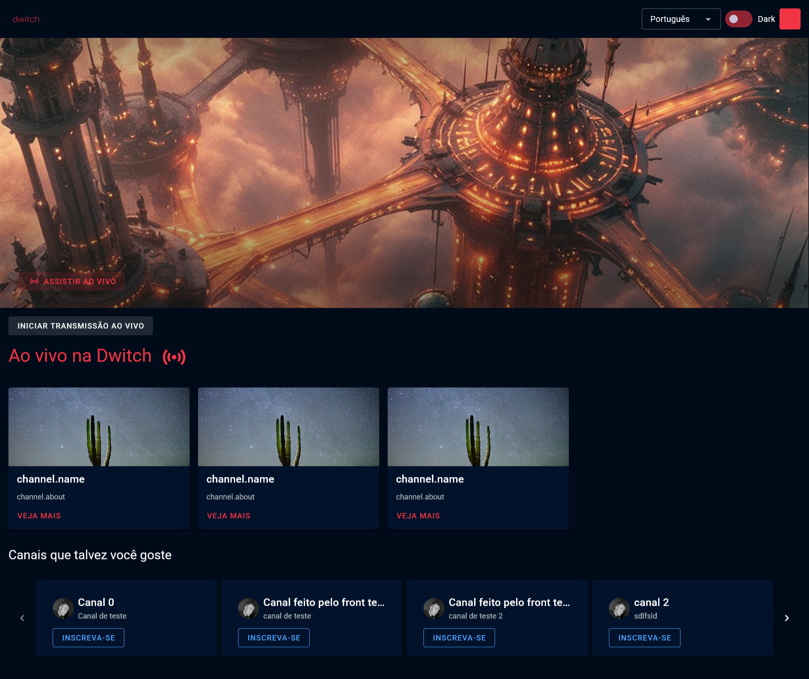
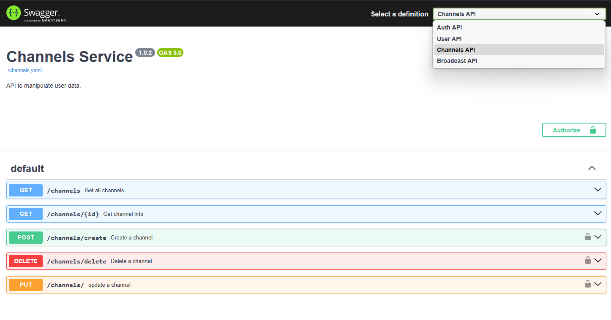

 
    

        
    

 

# Bem-Vindo ao Dwitch!

### Esse repositório tem o propósito de apresentar o desenvolvimento feito de um MVP baseado na Twitch.

### Sumário

- [Sobre o projeto](#sobre-o-projeto)
- [Sobre as ferramentas](#sobre-as-ferramentas-utilizadas)
- [Sobre cada módulo](#sobre-cada-módulo)

### Rodando o projeto

### **DOING - comandos**

### Sobre o projeto

Nessa plataforma, você pode se cadastrar, fazer o login e simular o inicio de uma transmissão, além de visualizar os canais disponíveis já criados por outros usuários.

### Sobre as ferramentas utilizadas

Esse projeto está divido em 5 módulos - clique no nome para ir a seção

- [/dwitch-front](#dwitch-front)
- [/auth](#auth)
- [/broadcasts](#broadcasts)
- [/channels](#channels)
- [/user](#user)

O projeto também conta com 2 pacotes internos.

- [/packages > @dwitch/db-client](#@dwitch/db-client)
- [/packages > @dwitch/errors](#@dwitch/db-client)

No repositório há também outras pastas:

- **/assets** - Imagens utilizadas no readme
- **/docs** - Documentação das APIS
- **/tests** - Teste de carga com k6
- **/.github** - CI/CD (DOING)
- **/infra** - terraform (DOING)

#### Sobre cada módulo

#### /dwitch-front

> Ferramentas utilizadas e features
>
> - vue.js, vuetify, websocket, pinia, multi-tema, controle de acesso, escolha de idioma.
>     

Nesse módulo, temos a construção do front-end, nele utilizamos vue.js como ferramenta principal, além da biblioteca de componentes vuetify, também foi utilizado Pinia para gerenciamento de estado.

O usuário inicia a navegação pela rota /login, podendo escolher se cadastrar, caso necessário.

**/login**

**/register**

#### Controle de Acesso

Essa aplicação tem controle de acesso, não permitindo a visualização da rota "/", usuários deslogados são redirecionados para "/login".

#### Criação de Canal

Como falado anteriormente, após feito o acesso, o usuário pode criar um canal.

#### Inserção do alerta na fila

Uma vez criado o canal, o usuário pode fazer transmissões ao vivo.

#### Websocket

Ao iniciar uma transmissão, os usuários presentes irão ser notifcados.

#### Temas e Idiomas

O usuário pode trocar o tema do site entre Dark e Light e E também o idioma.

### /auth

> Ferramentas utilizadas
>
> - Fastify, jest - testes unitários e de integração -, k6, jwt, prisma (orm), open telemetry + jeager, zod.
>      

Esse módulo faz 3 funções: login, cadastro e validação de token sendo, portanto, o ponto de autenticação dos outros módulos.

Com o propósito de padronização, é utilizado dois pacotes: **@dwitch/db-client** - que cria a conexão com o banco e guarda query que gera o banco -, e **@dwicth/errors** - padroniza os errors das apis.

### /broadcasts

> Ferramentas utilizadas
>
> - fastify, rabbitmq, websocket, prisma, open telemtry + jeager.
>     

Esse módulo possui 2 funções: criar novas transmissões e transmitir essa informação para os usuários.

Para isso, ele expõe um endpoint http para iniciar um broadcast e um enpoint websocket para o recebimento do alerta das transmissões.

Foi utilizado o rabbitmq para mandar os alertas para filas e eventos nodejs para utilizar o websocket.

### /channels

> Ferramentas utilizadas e features
>
> - fastify, prisma, open telemtry + jeager, zod.
>     

Esse módulo possui um CRUD dos canais: cria, buscar, atualizar e apagar canais.

### /user

> Ferramentas utilizadas e features
>
> - fastify, prisma, open telemtry + jeager, zod.
>     

Esse módulo possui possui 3 funções: deletar conta - apenas o próprio usuário pode fazer isso, buscar informações da conta e buscar canal do usuário, para fins de simplificação, no momento só é retornado um canal por usuário.

### @dwitch/db-client

Esse pacote instancia o banco, mantém as tabelas e atualiza as relações do banco quando necessário.

### @dwitch/errors

Esse pacote padrozina o tratamento dos errors das apis.

### Dúvidas sobre as APIS?

Consulte a documentação

